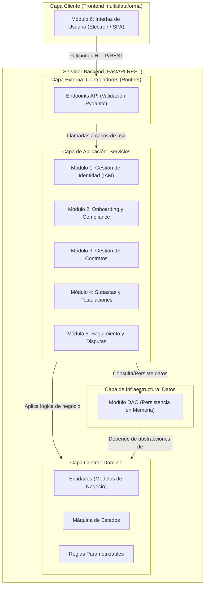

## 1. Estilo Arquitectónico

Estilo adoptado: **Arquitectura Limpia (Clean Architecture) combinada con Cliente-Servidor (API REST + SPA/Electron)**

Justificación basada en REF priorizados:

| REF ID | Descripción | Prioridad | Cómo lo aborda el estilo |
| --- | --- | --- | --- |
| REF-01 | Respuesta en < 2s (Rendimiento) | Alta | La separación en capas permite aislar la lógica asíncrona de FastAPI en los controladores (Routers) y optimizar el acceso a datos en la capa DAO sin bloquear el procesamiento del dominio. |
| REF-03 | Autenticación y Autorización requerida | Alta | El patrón de capas obliga a que todas las peticiones pasen por una barrera de seguridad en la capa de Routers/Servicios antes de tocar la lógica de negocio, centralizando la validación RBAC. |
| REF-04 | Integridad transaccional y prevención de concurrencia | Alta | Al aislar las reglas de negocio en una capa de Dominio pura (Domain), la validación de transiciones de subastas y contratos se ejecuta atómicamente antes de cualquier persistencia. |
| REF-13 | Interfaz intuitiva y simple | Alta | El modelo Cliente-Servidor desacopla totalmente la presentación (Frontend en Electron), permitiendo diseñar vistas enfocadas en la usabilidad sin verse restringidas por la complejidad del Backend. |

Explicación textual:
El estilo de Arquitectura Limpia, estructurado en capas concéntricas (Dominio, Servicios, DAO y Routers), asegura que las reglas centrales del negocio (como la máquina de estados de los contratos) sean completamente independientes de las tecnologías externas. Esto garantiza que ningún REF de alta prioridad quede sin abordar: la seguridad (REF-03) se maneja en los bordes de la API, el rendimiento (REF-01) se maximiza aislando las operaciones I/O en la capa externa asíncrona (FastAPI/Pydantic), la concurrencia (REF-04) se controla mediante entidades de dominio con responsabilidad única, y la usabilidad (REF-13) se delega a un cliente de escritorio especializado que consume servicios desacoplados.

## 2. Diagrama de Arquitectura

## 2. Diagrama de Arquitectura

El siguiente diagrama ilustra el estilo Cliente-Servidor y la separación en capas, detallando cómo interactúan los módulos definidos.

## 3. Descomposición Modular

Fundamentación: Los módulos se han delimitado aplicando principios SOLID (específicamente Responsabilidad Única) y agrupación por subdominios derivados directamente de las Épicas e Historias de Usuario (US) levantadas.

### Módulo 1: Gestión de Identidad y Accesos (IAM)

* Responsabilidad: Gestionar el registro de usuarios, validación de credenciales, control de roles (RBAC) y emisión de tokens de seguridad (aborda US-01, US-02, US-03).
* Ofrece a otros módulos: Tokens de sesión y validación de permisos de usuario (`usuario_service.py`).
* Depende de: Base de datos (DAO).

### Módulo 2: Onboarding y Compliance

* Responsabilidad: Administrar el ciclo de carga documental, perfiles tributarios y otorgar el estado de verificación operativa o bloqueos de seguridad (aborda US-04 a US-08).
* Ofrece a otros módulos: Bandera de estado de aprobación global (KYC Aprobado/Rechazado) para habilitar operaciones comerciales.
* Depende de: Módulo IAM (para identificar al usuario).

### Módulo 3: Gestión de Contratos

* Responsabilidad: Orquestar el ciclo de vida del contrato de carga, validando capacidades, requerimientos especiales y coherencia financiera mediante una máquina de estados (aborda US-09 a US-13).
* Ofrece a otros módulos: Entidades de contrato persistidas, estados vigentes y validaciones lógicas.
* Depende de: Módulo IAM, Módulo Onboarding (para verificar que el creador esté habilitado), Configuración Global.

### Módulo 4: Subastas y Postulaciones

* Responsabilidad: Centralizar la lógica de recepción de ofertas de transportistas sobre contratos activos y procesar la adjudicación (aborda US-14 a US-16).
* Ofrece a otros módulos: Identificador del transportista y camión adjudicado.
* Depende de: Módulo Gestión de Contratos, Módulo Onboarding, Módulo IAM.

### Módulo 5: Seguimiento y Disputas

* Responsabilidad: Controlar los cambios de estado operativos durante el transporte físico (En Tránsito, Entregado, En Disputa) y el cierre definitivo (aborda US-17 a US-20).
* Ofrece a otros módulos: Trazabilidad de estados y auditoría.
* Depende de: Módulo Gestión de Contratos.

### Módulo 6: Interfaz de Usuario (Cliente Electron)

* Responsabilidad: Proveer las vistas renderizadas dinámicamente según el rol del usuario, capturar la interacción y presentar los datos formatados (aborda US-23, US-24).
* Ofrece a otros módulos: Consumo y presentación de la API (Payloads HTTP).
* Depende de: Todos los módulos del Backend (vía endpoints RESTful).

## 4. Decisiones de Diseño

### Decisión 1

* Decisión: Implementación de la lógica de transiciones mediante el Patrón *State* (Máquina de Estados Finita).
* Motivación: Prevenir condiciones de carrera e inconsistencias lógicas detalladas en REF-04. Evita el uso intensivo de sentencias condicionales dispersas, asegurando que un contrato no pase de `BORRADOR` a `EN_TRANSITO` accidentalmente.
* Alternativas consideradas: Uso de banderas booleanas simples o condicionales anidados (If/Else) en la capa de servicios.
* Impacto: Afecta directamente al Módulo Gestión de Contratos y Subastas, centralizando la complejidad en la clase `MaquinaEstadosContrato` de la capa de Dominio.

### Decisión 2

* Decisión: Utilización de validadores Pydantic como frontera estricta de entrada y salida de datos.
* Motivación: Aborda el REF-01 (rendimiento mediante núcleo compilado) y REF-02/REF-06 (estandarización de interfaces RESTful).
* Alternativas consideradas: Validación manual mediante funciones auxiliares en Python estándar o uso de esquemas JSON en bruto.
* Impacto: Afecta a la capa de Routers de todos los módulos, garantizando que ninguna data malformada alcance la capa de servicios.

### Decisión 3

* Decisión: Inyección de dependencias para el almacenamiento de datos (Capa DAO).
* Motivación: Cumplir con REF-11 (Mantenibilidad), permitiendo desarrollar y testear el primer entregable con repositorios en memoria, facilitando el cambio futuro a una base de datos relacional sin tocar la lógica de negocio.
* Alternativas consideradas: Uso de variables globales o consultas SQL acopladas directamente en los controladores.
* Impacto: Afecta a todos los módulos del backend, aislando la tecnología de persistencia.
