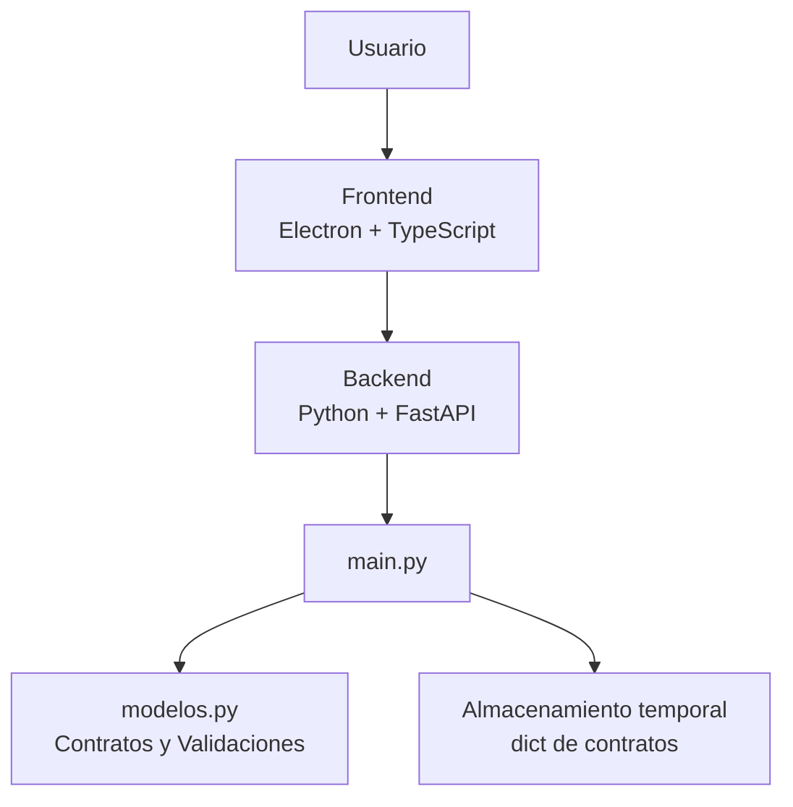
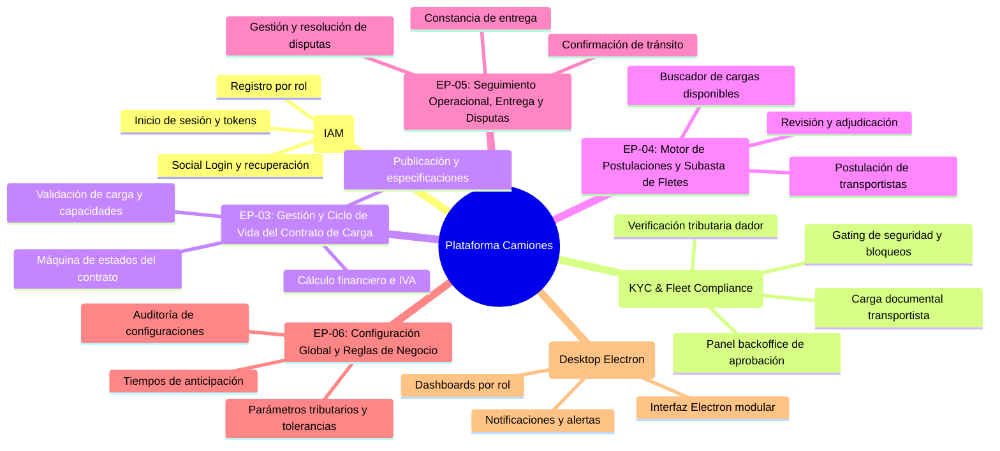

# Taller-Programacion
Este proyecto consiste en una plataforma integral multiplataforma (escritorio y web) orientada a la centralización y digitalización de contratos de transporte terrestre de carga. La solución funciona como un punto de encuentro entre empresas generadoras de carga y transportistas independientes o flotas de camioneros, optimizando el proceso de publicación, postulación, adjudicación y seguimiento de servicios de flete.

La arquitectura del sistema está estructurada mediante una separación clara de responsabilidades:

* **Frontend:** Desarrollado con **Electron** y **TypeScript**, proporciona una interfaz de usuario de escritorio multiplataforma, segura, altamente tipada y responsiva, garantizando una experiencia fluida e intuitiva para la gestión de contratos en tiempo real.
* **Backend:** Construido sobre **Python** utilizando **FastAPI**, actúa como una API REST de alto rendimiento y ejecución asíncrona. Se encarga de la lógica de negocio, la validación estricta de datos, la gestión del ciclo de vida de los acuerdos comerciales y la comunicación eficiente con la capa de presentación.

---

Cronologias de cambios, informes y cambios sustanciales : https://docs.google.com/document/d/1p95pKZ2zpQuFnw19-MtfZ5WIhdKAEz30nYLUg9G9B-U/edit?tab=t.0

---

## Requisitos del Sistema

Para el despliegue local en entorno de desarrollo se requiere:

* **Node.js**: v20.x (LTS) o superior
* **npm**: v10.x o superior
* **Python**: v3.10.0 o superior
* **fastapi**: ~0.109.0
* **uvicorn**: ~0.27.0
* **pydantic**: ~2.6.0

---

## Instalación y Configuración

### 1. Clonar el Repositorio
```bash
git clone https://github.com/hamburgetestudent/Camiones_contratos.git
cd Camiones_contratos
```

### 2. Configuración del Backend (FastAPI)
```bash
python -m venv venv

# Activación del entorno virtual
# En Linux/macOS:
source venv/bin/activate
# En Windows:
venv\Scripts\activate

pip install -r requirements.txt
uvicorn main:app --reload --host 127.0.0.1 --port 8000
```
> La documentación interactiva de la API estará disponible en `http://127.0.0.1:8000/docs`.

### 3. Configuración del Frontend (Electron)
```bash
cd frontend
npm install
npm run dev
```

### 4. Pruebas Automatizadas (Pytest)
```bash
pip install -r requirements-dev.txt
pytest -v
```

---

## Verificación post-instalación

Para confirmar que el servidor y la base de datos están funcionando correctamente, sigue los siguientes pasos:

1. **Verificación del Servidor HTTP (FastAPI):**
   - Inicia la aplicación ejecutando `uvicorn main:app --reload --host 127.0.0.1 --port 8000`.
   - Abre tu navegador en `http://127.0.0.1:8000/docs` para acceder a la documentación interactiva OpenAPI (Swagger UI).
   - Confirma que la interfaz liste correctamente todos los routers cargados (`/auth`, `/configuracion`, `/contratos`, `/onboarding`, `/subastas`).

2. **Verificación de Endpoints y Base de Datos:**
   - Realiza una petición GET al endpoint `http://127.0.0.1:8000/configuracion`. Deberías recibir una respuesta con código HTTP 200 OK y el cuerpo JSON correspondiente a las reglas de negocio globales.
   - Asegúrate de que las variables de entorno estén definidas en `.env` (copiado de `.env.example`). En caso de utilizar una base de datos PostgreSQL, verifica la conectividad con las credenciales indicadas en `DATABASE_URL`.

3. **Verificación de la Suite de Pruebas:**
   - Ejecuta `pytest -v` en la terminal para asegurarte de que todas las pruebas unitarias y de integración se ejecuten correctamente sin errores.

---

## Arquitectura del sistema

La arquitectura del sistema está estructurada mediante una separación clara de responsabilidades:

- **Frontend:** Desarrollado con **Electron** y **TypeScript**, proporciona la interfaz de usuario de escritorio.
- **Backend:** Construido con **Python** y **FastAPI**, se encarga de los endpoints, la lógica de negocio y la validación de los contratos.
- **Autenticación:** Gestión de registro y login modular desacoplado (`routers/login_router.py`, `services/login_service.py`, `domain/modelos_login.py`) conectado al validador del sistema de usuarios.
- **Modelos:** El archivo `modelos.py` contiene la estructura de los contratos y sus validaciones.
- **Almacenamiento:** Actualmente los contratos se almacenan temporalmente en un diccionario de Python, utilizado como almacenamiento en memoria.

### Diagrama de arquitectura


# HITO 1: FUNDAMENTOS DE INGENIERÍA DE SOFTWARE
## [MansoViaje]

### 1. Descripción del Sistema
Plataforma digital intermediaria de cobertura nacional orientada a conectar a generadores de carga (empresas, productores, intermediarios o particulares) con transportistas (camioneros independientes y empresas con flotas). 

El modelo opera como un mercado descentralizado con asignación mediante subastas y postulaciones, formalización de acuerdos por viaje y un sistema de pagos en custodia (Escrow) para garantizar liquidez al transportista y seguridad al dador de carga. La plataforma actúa como mediadora y no es propietaria ni responsable directa de la flota vehicular.

---

### 2. Definición de Actores y Arquetipos (Personas)

* **Dador de Carga (Generador/Cliente):**
  * Empresas consolidadas, PYMEs, brokers o particulares.
  * Publica necesidades de transporte (origen, destino, tipo de carga, fechas y requerimientos técnicos).
  * Evalúa postulaciones, selecciona la oferta ganadora y financia el contrato.

* **Transportista (Oferente):**
  * Conductores independientes o empresas de transporte con múltiples vehículos.
  * Registra sus unidades y conductores asociados.
  * Postula con tarifas competitivas a las cargas publicadas.

---

### 3. Historias de Usuario

| ID | Nombre | Issue |
|---|---|---|
| HU-IAM-01 | Registro de Usuarios por Rol | #50 |
| HU-IAM-02 | Inicio de Sesión y Emisión de Credenciales | #51 |
| HU-IAM-03 | Interfaz de Inicio de Sesión y Autenticación Federada (UI) | #52 |
| HU-ONB-01 | Carga y Reemplazo de Documentos del Transportista | #53 |
| HU-UI-01 | Configuración y Empaquetado de la Aplicación Electron | #54 |
| HU-ONB-02 | Consulta de Estado Global de Habilitación del Transportista | #55 |
| HU-CFG-02 | Modificación en Caliente de Políticas del Negocio | #56 |
| HU-ONB-03 | Registro y Actualización del Perfil Tributario del Dador de Carga | #57 |
| HU-ONB-04 | Panel Backoffice de Revisión y Validación Documental | #58 |
| HU-CFG-01 | Consulta de Configuración de Negocio Vigente | #59 |

---

### 4. Requisitos Extrafuncionales
Ver: `ReqExtrafuncionales.md`

---

### 5. Entidades del Dominio



---

### 6. Diseño Arquitectónico
Ver: `Arquitectura.md`

| Mockup | Historia de usuario relacionada |
|---|---|
| [Prototipo Figma](https://www.figma.com/design/leoA2Ejoi6cJi13esWBsXQ/Contratos_camioneros_centralizados?node-id=0-1&t=v76XFzFL7hSGl8TY-1) | HU-IAM-01 |

---

### 7. Responsabilidades del Equipo

| Integrante | Rol | Ítems de la rúbrica a cargo |
|---|---|---|
| Benjamín Ponce | PM | 1.2 |
| Cristian Palma | Backend | 1.2, Issue del profesor |
| Santiago Sanchez | Backend | 1.2, 2.1, 2.2 |
| Fabian Ahumada | Backend | 1.1, 2.4 |
| Gabriel Alvares | Frontend | 2.3, 2.4 |
