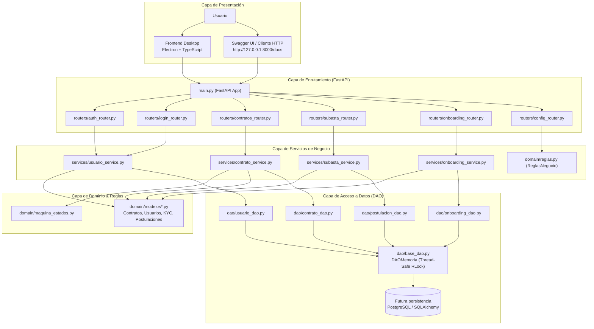
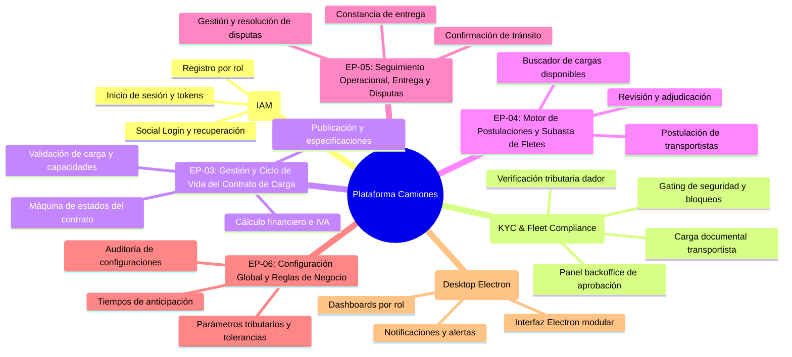

# Taller-Programacion

Este proyecto consiste en una plataforma integral multiplataforma (escritorio y web) orientada a la centralización y digitalización de contratos de transporte terrestre de carga. La solución funciona como un punto de encuentro entre empresas generadoras de carga (dadores de carga) y transportistas independientes o flotas de camioneros, optimizando el ciclo completo de publicación, postulación, adjudicación, verificación de cumplimiento (KYC) y seguimiento de servicios de flete.

La arquitectura del sistema está estructurada mediante una separación clara de responsabilidades por capas:

* **Frontend:** Desarrollado con **Electron** y **TypeScript**, proporciona una interfaz de usuario de escritorio multiplataforma, segura, fuertemente tipada y responsiva, garantizando una experiencia fluida e intuitiva para la gestión comercial y operativa en tiempo real.
* **Backend:** Construido sobre **Python** utilizando **FastAPI**, actúa como una API REST modular de alto rendimiento y ejecución asíncrona. Se encarga de la lógica de negocio, validaciones estrictas con **Pydantic**, gestión del ciclo de vida de los contratos mediante una máquina de estados finitos, persistencia mediante el patrón **DAO** y servicios de subastas y onboarding.

---

Cronologías de cambios, informes y cambios sustanciales: https://docs.google.com/document/d/1p95pKZ2zpQuFnw19-MtfZ5WIhdKAEz30nYLUg9G9B-U/edit?tab=t.0

---

## Requisitos del Sistema

Para el despliegue local en entorno de desarrollo se requiere:

* **Node.js**: v20.x (LTS) o superior
* **npm**: v10.x o superior
* **Python**: v3.10.0 o superior (compatible con Python 3.10 hasta 3.14)
* **fastapi**: >=0.109.0
* **uvicorn**: >=0.27.0
* **pydantic**: >=2.6.0

---

## Instalación y Configuración

### 1. Clonar el Repositorio
```bash
git clone https://github.com/hamburgetestudent/Camiones_contratos.git
cd Camiones_contratos
```

### 2. Configuración del Backend (FastAPI)
```bash
python -m venv venv

# Activación del entorno virtual
# En Linux/macOS:
source venv/bin/activate
# En Windows:
venv\Scripts\activate

pip install -r requirements.txt
uvicorn main:app --reload --host 127.0.0.1 --port 8000
```
> La documentación interactiva de la API estará disponible en `http://127.0.0.1:8000/docs`.

### 3. Configuración del Frontend (Electron)
```bash
cd frontend
npm install

# Compilar TypeScript e iniciar la aplicación Electron:
npm start

# O modo observador (watch mode) para desarrollo de TypeScript:
npm run dev
```

### 4. Ejecución Integral del Sistema

Dispones de dos formas automatizadas para operar la plataforma:

#### Opción A: Lanzador Completo (Backend FastAPI + Frontend Electron)
Ejecuta simultáneamente el backend y la ventana de escritorio en un solo comando:
```bash
python run.py
```
> `run.py` verifica el entorno virtual, comprueba dependencias de Node/npm, aguarda a que el servidor FastAPI esté respondiendo en el puerto 8000 e inicia la interfaz de Electron.

#### Opción B: Consola Interactiva y Centro de Control (`inicio_test.py`)
Compilador, verificador de código, lanzador y consola CLI interactiva para operar toda la lógica sin dependencias externas:
```bash
python inicio_test.py
```
Opciones directas por línea de comandos:
* `python inicio_test.py -c`: Compila y valida sintaxis (AST) y bytecode de todos los módulos.
* `python inicio_test.py -s`: Inicia el servidor backend FastAPI y abre automáticamente Swagger UI.
* `python inicio_test.py -f`: Inicia el frontend (en Electron o en navegador web local).
* `python inicio_test.py -a`: Inicia el sistema completo (Backend + Frontend).
* `python inicio_test.py --cli`: Abre directamente la consola interactiva CLI para operar contratos, subastas y usuarios.
* `python inicio_test.py -t`: Ejecuta la suite de pruebas unitarias automatizadas.
* `python inicio_test.py --clean`: Limpia archivos temporales y carpetas `__pycache__`.

### 5. Pruebas Automatizadas
Para ejecutar la suite de pruebas unitarias e integración de la plataforma:
```bash
# Opción 1: Mediante el runner integrado
python inicio_test.py -t

# Opción 2: Mediante Pytest (requiere requirements-dev.txt)
pip install -r requirements-dev.txt
pytest inicio_test.py -v
```

---

## Verificación post-instalación

Para confirmar que el servidor y los módulos están funcionando correctamente:

1. **Verificación del Servidor HTTP (FastAPI):**
   - Inicia la aplicación con `uvicorn main:app --reload --host 127.0.0.1 --port 8000` (o `python inicio_test.py -s`).
   - Abre tu navegador en `http://127.0.0.1:8000/docs` para acceder a la documentación interactiva OpenAPI (Swagger UI).
   - Confirma que la interfaz liste correctamente todos los routers cargados:
     - `/auth` (Gestión de autenticación de usuarios)
     - `/login` (Autenticación modular y tokens)
     - `/configuracion` (Reglas de negocio globales)
     - `/contratos` (Creación, listado y transición de estados)
     - `/onboarding` (Verificación KYC de transportistas y dadores de carga)
     - `/subastas` (Postulaciones, ofertas y adjudicación de fletes)

2. **Verificación de Endpoints:**
   - Realiza una petición GET al endpoint `http://127.0.0.1:8000/configuracion`. Deberías recibir una respuesta HTTP 200 OK con el cuerpo JSON correspondiente a las reglas de negocio globales (IVA, tolerancias de carga, tiempo de expiración).

3. **Verificación de la Suite de Pruebas:**
   - Ejecuta `python inicio_test.py -t` en la terminal para asegurarte de que todas las pruebas unitarias y de arquitectura pasen al 100% sin errores.

---

## Arquitectura del sistema

La arquitectura del proyecto implementa una separación por capas de software limpia y desacoplada:

```
COdigo/
├── domain/
│   ├── modelos.py
│   ├── modelos_usuario.py
│   ├── modelos_login.py
│   ├── modelos_onboarding.py
│   ├── postulacion.py
│   ├── maquina_estados.py
│   └── reglas.py
├── dao/
│   ├── base_dao.py
│   ├── contrato_dao.py
│   ├── usuario_dao.py
│   ├── postulacion_dao.py
│   └── onboarding_dao.py
├── services/
│   ├── contrato_service.py
│   ├── usuario_service.py
│   ├── login_service.py
│   ├── onboarding_service.py
│   ├── subasta_service.py
│   └── dependencies.py
├── routers/
│   ├── auth_router.py
│   ├── login_router.py
│   ├── config_router.py
│   ├── contratos_router.py
│   ├── onboarding_router.py
│   ├── subasta_router.py
│   └── comun.py
├── frontend/
│   ├── src/
│   │   └── main.ts
│   ├── paginas/
│   │   ├── Login/
│   │   │   ├── index.html
│   │   │   ├── style.css
│   │   │   └── script.js
│   │   ├── registrar/
│   │   │   ├── registro.html
│   │   │   ├── registro.css
│   │   │   └── registro.js
│   │   └── imagenes/
│   └── package.json
├── main.py
├── run.py
├── inicio_test.py
├── requirements.txt
└── requirements-dev.txt
```

### Descripción de Módulos y Capas

* **Capa de Dominio (`domain/`)**:
  * `modelos.py`: Modelos de Contratos de transporte (`ContratoCrear`, `ContratoModelo`), tipos de carga y monedas con validaciones Pydantic.
  * `modelos_usuario.py`: Modelos de Usuarios y Roles (`Empresa`, `Transportista`, `Admin`) y validaciones de formato.
  * `modelos_login.py`: Modelos y esquemas de datos para autenticación y respuestas de inicio de sesión.
  * `modelos_onboarding.py`: Modelos de cumplimiento y KYC (`DadorCarga`, `DocumentoTransportista`, `TipoDocumento`, `EstadoValidacion`).
  * `postulacion.py`: Modelos para ofertas y postulaciones a cargas publicadas.
  * `maquina_estados.py`: Máquina de estados finitos que valida las transiciones del ciclo de vida del contrato.
  * `reglas.py`: Patrón Singleton que centraliza las reglas de negocio globales (IVA, tolerancias de carga, tiempos límite).

* **Capa de Acceso a Datos (`dao/`)**:
  * `base_dao.py`: Interfaz genérica `BaseDAO` e implementación `DAOMemoria` con bloqueo thread-safe mediante `threading.RLock`.
  * `contrato_dao.py`: Persistencia y consultas para contratos de transporte.
  * `usuario_dao.py`: Persistencia y consultas para usuarios (búsqueda por ID y por email normalizado).
  * `postulacion_dao.py`: Persistencia y consultas de postulaciones vinculadas a cargas.
  * `onboarding_dao.py`: Persistencia de perfiles de dador y documentos tributarios/legales.

* **Capa de Servicios de Negocio (`services/`)**:
  * `contrato_service.py`: Lógica de creación, cálculo de montos y avance de estados de contratos.
  * `usuario_service.py`: Registro, hashing de contraseñas (SHA-256) y validación de usuarios.
  * `login_service.py`: Servicio de autenticación modular desacoplado.
  * `onboarding_service.py`: Flujo de validación y aprobación KYC de transportistas y empresas.
  * `subasta_service.py`: Motor de subastas, registro de ofertas y adjudicación de fletes.
  * `dependencies.py`: Factorías e inyección de dependencias para los routers.

* **Capa de Routers API REST (`routers/`)**:
  * `auth_router.py`: Endpoints de autenticación general (`/auth`).
  * `login_router.py`: Endpoints modulares de inicio de sesión (`/login`).
  * `config_router.py`: Endpoints de configuración de reglas globales (`/configuracion`).
  * `contratos_router.py`: Endpoints CRUD y transición de estados de contratos (`/contratos`).
  * `onboarding_router.py`: Endpoints de KYC y cumplimiento (`/onboarding`).
  * `subasta_router.py`: Endpoints de subastas y postulaciones (`/subastas`).
  * `comun.py`: Utilidades, esquemas de error y respuestas comunes.

* **Capa de Frontend (`frontend/`)**:
  * `src/main.ts`: Proceso principal de Electron que configura la ventana de escritorio y carga las vistas.
  * `paginas/Login/`: Interfaz de inicio de sesión (`index.html`, `style.css`, `script.js`).
  * `paginas/registrar/`: Interfaz de registro de usuarios y dadores (`registro.html`, `registro.css`, `registro.js`).
  * `package.json`: Configuración de scripts (`npm start`, `npm run dev`) y dependencias de Electron.

* **Puntos de Entrada y Herramientas Raíz**:
  * `main.py`: Inicializador de FastAPI y montaje de routers modulares.
  * `run.py`: Script de orquestación simultánea (Backend FastAPI + Frontend Electron).
  * `inicio_test.py`: Compilador, suite de verificación, runner de tests y consola interactiva CLI.
  * `requirements.txt`: Dependencias principales del Backend en Python.
  * `requirements-dev.txt`: Dependencias adicionales para testing y desarrollo.

### Ciclo de Vida del Contrato (Máquina de Estados)

Los contratos atraviesan un ciclo formal validado por `domain.maquina_estados.MaquinaEstadosContrato`:
* `BORRADOR` ➔ `PUBLICADO` ➔ `EN_POSTULACION` ➔ `ADJUDICADO` ➔ `EN_TRANSITO` ➔ `FINALIZADO`
* Cualquier estado puede transicionar a `CANCELADO` antes de su finalización.

### Diagrama de Arquitectura en Capas


# HITO 1: FUNDAMENTOS DE INGENIERÍA DE SOFTWARE
## [MansoViaje]

### 1. Descripción del Sistema
Plataforma digital intermediaria de cobertura nacional orientada a conectar a generadores de carga (empresas, productores, intermediarios o particulares) con transportistas (camioneros independientes y empresas con flotas). 

El modelo opera como un mercado descentralizado con asignación mediante subastas y postulaciones, formalización de acuerdos por viaje y un sistema de pagos en custodia (Escrow) para garantizar liquidez al transportista y seguridad al dador de carga. La plataforma actúa como mediadora y no es propietaria ni responsable directa de la flota vehicular.

---

### 2. Definición de Actores y Arquetipos (Personas)

* **Dador de Carga (Generador/Cliente):**
  * Empresas consolidadas, PYMEs, brokers o particulares.
  * Publica necesidades de transporte (origen, destino, tipo de carga, fechas y requerimientos técnicos).
  * Evalúa postulaciones, selecciona la oferta ganadora y financia el contrato.

* **Transportista (Oferente):**
  * Conductores independientes o empresas de transporte con múltiples vehículos.
  * Registra sus unidades y conductores asociados.
  * Postula con tarifas competitivas a las cargas publicadas.

---

### 3. Historias de Usuario

| ID | Nombre | Issue |
|---|---|---|
| HU-IAM-01 | Registro de Usuarios por Rol | #50 |
| HU-IAM-02 | Inicio de Sesión y Emisión de Credenciales | #51 |
| HU-IAM-03 | Interfaz de Inicio de Sesión y Autenticación Federada (UI) | #52 |
| HU-ONB-01 | Carga y Reemplazo de Documentos del Transportista | #53 |
| HU-UI-01 | Configuración y Empaquetado de la Aplicación Electron | #54 |
| HU-ONB-02 | Consulta de Estado Global de Habilitación del Transportista | #55 |
| HU-CFG-02 | Modificación en Caliente de Políticas del Negocio | #56 |
| HU-ONB-03 | Registro y Actualización del Perfil Tributario del Dador de Carga | #57 |
| HU-ONB-04 | Panel Backoffice de Revisión y Validación Documental | #58 |
| HU-CFG-01 | Consulta de Configuración de Negocio Vigente | #59 |

---

### 4. Requisitos Extrafuncionales
Ver: `ReqExtrafuncionales.md`

---

### 5. Entidades del Dominio



---

### 6. Diseño Arquitectónico
Ver: `Arquitectura.md`

| Mockup | Historia de usuario relacionada |
|---|---|
| [Prototipo Figma](https://www.figma.com/design/leoA2Ejoi6cJi13esWBsXQ/Contratos_camioneros_centralizados?node-id=0-1&t=v76XFzFL7hSGl8TY-1) | HU-IAM-01 |

---

### 7. Responsabilidades del Equipo

| Integrante | Rol | Ítems de la rúbrica a cargo |
|---|---|---|
| Benjamín Ponce | PM | 1.2 |
| Cristian Palma | Backend | 1.2, Issue del profesor |
| Santiago Sanchez | Backend | 1.2, 2.1, 2.2 |
| Fabian Ahumada | Backend | 1.1, 2.4 |
| Gabriel Alvares | Frontend | 2.3, 2.4 |
