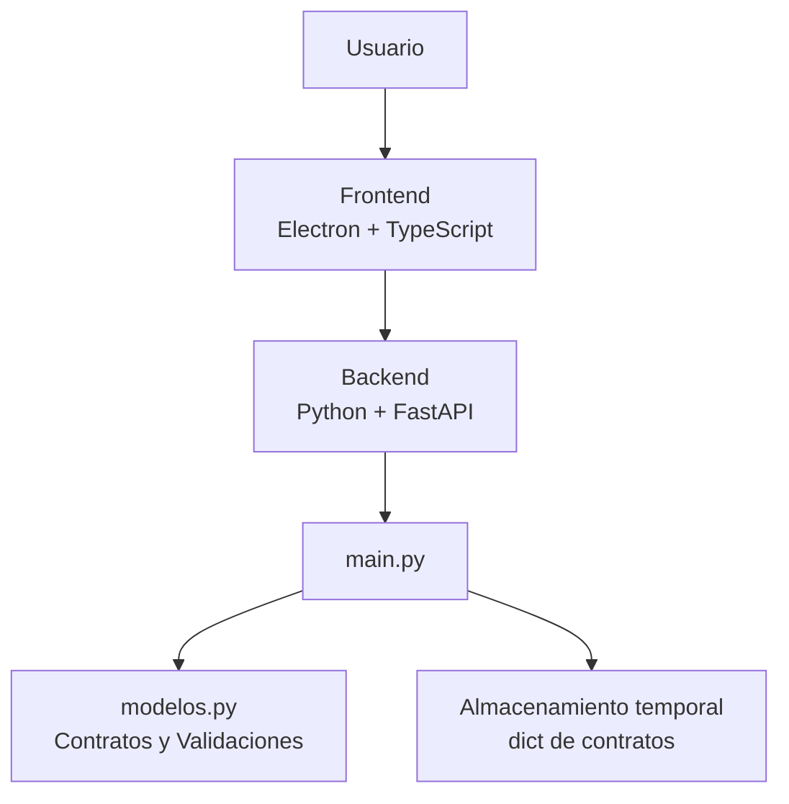
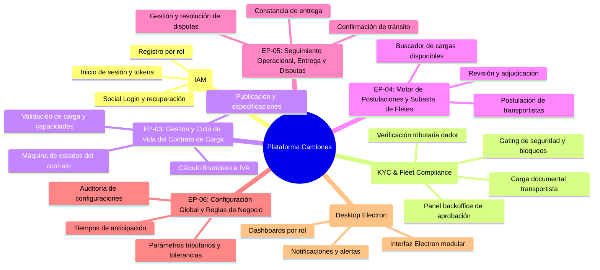

# Taller-Programacion
Este proyecto consiste en una plataforma integral multiplataforma (escritorio y web) orientada a la centralización y digitalización de contratos de transporte terrestre de carga. La solución funciona como un punto de encuentro entre empresas generadoras de carga y transportistas independientes o flotas de camioneros, optimizando el proceso de publicación, postulación, adjudicación y seguimiento de servicios de flete.

La arquitectura del sistema está estructurada mediante una separación clara de responsabilidades:

* **Frontend:** Desarrollado con **Electron** y **TypeScript**, proporciona una interfaz de usuario de escritorio multiplataforma, segura, altamente tipada y responsiva, garantizando una experiencia fluida e intuitiva para la gestión de contratos en tiempo real.
* **Backend:** Construido sobre **Python** utilizando **FastAPI**, actúa como una API REST de alto rendimiento y ejecución asíncrona. Se encarga de la lógica de negocio, la validación estricta de datos, la gestión del ciclo de vida de los acuerdos comerciales y la comunicación eficiente con la capa de presentación.

---

Cronologias de cambios, informes y cambios sustanciales : https://docs.google.com/document/d/1p95pKZ2zpQuFnw19-MtfZ5WIhdKAEz30nYLUg9G9B-U/edit?tab=t.0

---

## Requisitos del Sistema

Para el despliegue local en entorno de desarrollo se requiere:

* **Node.js**: v20.x (LTS) o superior
* **npm**: v10.x o superior
* **Python**: v3.10.0 o superior
* **fastapi**: ~0.109.0
* **uvicorn**: ~0.27.0
* **pydantic**: ~2.6.0

---

## Instalación y Configuración

### 1. Clonar el Repositorio
```bash
git clone https://github.com/hamburgetestudent/Camiones_contratos.git
cd Camiones_contratos
```

### 2. Configuración del Backend (FastAPI)
```bash
python -m venv venv

# Activación del entorno virtual
# En Linux/macOS:
source venv/bin/activate
# En Windows:
venv\Scripts\activate

pip install -r requirements.txt
uvicorn main:app --reload --host 127.0.0.1 --port 8000
```
> La documentación interactiva de la API estará disponible en `http://127.0.0.1:8000/docs`.

### 3. Configuración del Frontend (Electron)
```bash
cd frontend
npm install
npm run dev
```

### 4. Pruebas Automatizadas (Pytest)
```bash
pip install -r requirements-dev.txt
pytest -v
```

---

## Verificación post-instalación

Para confirmar que el servidor y la base de datos están funcionando correctamente, sigue los siguientes pasos:

1. **Verificación del Servidor HTTP (FastAPI):**
   - Inicia la aplicación ejecutando `uvicorn main:app --reload --host 127.0.0.1 --port 8000`.
   - Abre tu navegador en `http://127.0.0.1:8000/docs` para acceder a la documentación interactiva OpenAPI (Swagger UI).
   - Confirma que la interfaz liste correctamente todos los routers cargados (`/auth`, `/configuracion`, `/contratos`, `/onboarding`, `/subastas`).

2. **Verificación de Endpoints y Base de Datos:**
   - Realiza una petición GET al endpoint `http://127.0.0.1:8000/configuracion`. Deberías recibir una respuesta con código HTTP 200 OK y el cuerpo JSON correspondiente a las reglas de negocio globales.
   - Asegúrate de que las variables de entorno estén definidas en `.env` (copiado de `.env.example`). En caso de utilizar una base de datos PostgreSQL, verifica la conectividad con las credenciales indicadas en `DATABASE_URL`.

3. **Verificación de la Suite de Pruebas:**
   - Ejecuta `pytest -v` en la terminal para asegurarte de que todas las pruebas unitarias y de integración se ejecuten correctamente sin errores.

---

## Arquitectura del sistema

La arquitectura del sistema está estructurada mediante una separación clara de responsabilidades:

- **Frontend:** Desarrollado con **Electron** y **TypeScript**, proporciona la interfaz de usuario de escritorio.
- **Backend:** Construido con **Python** y **FastAPI**, se encarga de los endpoints, la lógica de negocio y la validación de los contratos.
- **Autenticación:** Gestión de registro y login modular desacoplado (`routers/login_router.py`, `services/login_service.py`, `domain/modelos_login.py`) conectado al validador del sistema de usuarios.
- **Modelos:** El archivo `modelos.py` contiene la estructura de los contratos y sus validaciones.
- **Almacenamiento:** Actualmente los contratos se almacenan temporalmente en un diccionario de Python, utilizado como almacenamiento en memoria.

### Diagrama de arquitectura



## HITO 1 FUNDAMNETOS DE INGENIERIA SOFWARE

# 📋 Especificación de Épicas e Historias de Usuario (Backlog del Producto)
## Plataforma de Digitalización y Centralización de Contratos de Transporte Terrestre de Carga

---

## 1. Resumen Ejecutivo del Proyecto

El proyecto **Camiones_contratos** es una plataforma tecnológica integral (escritorio y web) orientada a la centralización, formalización y digitalización del ciclo de vida de contratos de transporte terrestre de carga. Funciona como un punto de encuentro B2B (*marketplace* logístico) entre:

1. **Empresas Dadoras de Carga (Generadores):** Empresas que requieren movilizar productos, materias primas o mercancías especiales.
2. **Transportistas (Flotas de camiones o choferes independientes):** Operadores logísticos y conductores verificados que ofrecen capacidad vehicular para fletes.
3. **Administradores de Backoffice (Operadores y Compliance):** Personal interno encargado de la verificación documental (KYC/Fleet Compliance), resolución de disputas y parametrización de políticas comerciales.

### Stack Tecnológico y Arquitectura Identificada
* **Backend:** Python (v3.14+) sobre **FastAPI**, con esquemas y validaciones estrictas en **Pydantic v2**, diseño modular en capas (Domain-Driven Design / Clean Architecture: *Domain, DAO, Services, Routers*).
* **Control de Estado y Reglas:** Máquinas de estado finitas desacopladas (`MaquinaEstadosContrato`, `MaquinaEstadoPostulacion`) y configuración parametrizable singleton (`ReglasNegocio`).
* **Frontend:** Aplicación de escritorio multiplataforma desarrollada en **Electron**, **TypeScript**, **HTML5** y **CSS3**.

---

## 2. Definición de Actores y Arquetipos (Personas)

| Actor / Rol | Descripción y Responsabilidades |
| :--- | :--- |
| **Dador de Carga (`DADOR_CARGA`)** | Empresa o cliente corporativo que publica requerimientos de transporte, define presupuestos, valida postulaciones de transportistas y adjudica contratos de flete. |
| **Transportista (`TRANSPORTISTA`)** | Conductor independiente o empresa de transporte propietaria de camiones. Sube documentación para certificación legal/operativa, busca cargas disponibles y postula tarifas o servicios. |
| **Administrador Backoffice (`ADMIN_BACKOFFICE`)** | Agente de control y soporte. Revisa y aprueba/rechaza documentación tributaria y de flota (KYC), resuelve disputas operativas y ajusta variables globales del negocio (IVA, tolerancias, etc.). |
| **Sistema / Motor Automático** | Ejecutor de reglas de negocio, transiciones automáticas de la máquina de estados, validaciones matemáticas/legales y bloqueos de seguridad por falta de cumplimiento (*compliance*). |

---

## 3. Mapa General de Épicas



---

## 4. Desglose Detallado de Épicas e Historias de Usuario

---

### 🛡️ ÉPICA 1: Autenticación, Gestión de Identidad y Accesos (IAM)
**Objetivo:** Proporcionar un sistema seguro de registro, autenticación y control de acceso basado en roles (RBAC) para los diferentes usuarios de la plataforma.

#### HU-IAM-01: Registro de Usuarios por Rol
* **Como:** Nuevo usuario (transportista o dador de carga).
* **Quiero:** Registrarme en la plataforma ingresando mi nombre, email, contraseña y seleccionando mi rol de operación.
* **Para:** Obtener una cuenta de acceso y comenzar el proceso de habilitación en la plataforma.
* **Criterios de Aceptación:**
  * **Dado** que el usuario ingresa un correo con formato válido y una contraseña de al menos 6 caracteres.
  * **Cuando** envía la solicitud al endpoint `POST /auth/registro`.
  * **Entonces** el sistema valida que el correo no se encuentre registrado previamente; si existe, responde `HTTP 400 Bad Request ("El email ya está registrado")`.
  * **Y** almacena la contraseña de forma segura (mediante hash criptográfico) y crea el usuario asignando un UUID único y el rol especificado (`TRANSPORTISTA`, `DADOR_CARGA`, etc.).
* **Prioridad:** Alta (Must Have)
* **Complejidad:** 3 Puntos de Historia (SP)
* **Trazabilidad Técnica:** `domain/modelos_usuario.py`, `services/usuario_service.py`, `routers/auth_router.py`.

#### HU-IAM-02: Inicio de Sesión y Emisión de Credenciales
* **Como:** Usuario registrado.
* **Quiero:** Iniciar sesión con mi correo electrónico y contraseña.
* **Para:** Acceder a las funciones privadas de la aplicación según mis privilegios de rol.
* **Criterios de Aceptación:**
  * **Dado** que el usuario envía sus credenciales mediante formulario estándar OAuth2 a `POST /auth/login`.
  * **Cuando** las credenciales coinciden con el registro persistido y su hash es validado.
  * **Entonces** el sistema retorna una respuesta exitosa con el token de acceso, el tipo de token (*Bearer*) y el rol del usuario.
  * **Si** el usuario no existe o la contraseña no coincide, responde `HTTP 401 Unauthorized ("Credenciales inválidas")`.
* **Prioridad:** Alta (Must Have)
* **Complejidad:** 3 SP
* **Trazabilidad Técnica:** `routers/auth_router.py`, `services/usuario_service.py`.

#### HU-IAM-03: Interfaz de Inicio de Sesión y Autenticación Federada (UI)
* **Como:** Usuario de la aplicación de escritorio.
* **Quiero:** Disponer de una interfaz gráfica intuitiva con opciones de ingreso manual y accesos rápidos de inicio de sesión social (Google, Microsoft, Apple).
* **Para:** Iniciar sesión de forma rápida y moderna.
* **Criterios de Aceptación:**
  * **Dado** que el usuario abre la pantalla principal de la aplicación.
  * **Cuando** visualiza el formulario de login, se deben presentar campos validados de email y password, botón "Sign In", enlace "¿Se te olvidó la contraseña?" y botones para proveedores sociales.
  * **Si** hace clic en iniciar sesión sin completar campos requeridos, el sistema despliega un mensaje interactivo de validación sin enviar peticiones inválidas a la API.
* **Prioridad:** Media (Should Have)
* **Complejidad:** 2 SP
* **Trazabilidad Técnica:** `frontend/paginas/index.html`, `frontend/paginas/script.js`, `frontend/paginas/style.css`.

---

### 📑 ÉPICA 2: Onboarding, Cumplimiento y Verificación Documental (KYC & Fleet Compliance)
**Objetivo:** Garantizar que todos los actores cumplan con los requisitos legales, técnicos y tributarios vigentes antes de operar o comprometer acuerdos comerciales en el sistema.

#### HU-ONB-01: Carga y Reemplazo de Documentos del Transportista
* **Como:** Conductor o dueño de flota (`TRANSPORTISTA`).
* **Quiero:** Cargar mis documentos obligatorios (Licencia, Padrón, Revisión Técnica, Seguro de Carga y Antecedentes).
* **Para:** Iniciar la certificación técnica de mi vehículo y de mi persona en la plataforma.
* **Criterios de Aceptación:**
  * **Dado** un usuario autenticado con rol Transportista (`X-User-Id` en encabezado).
  * **Cuando** envía un documento a `POST /onboarding/transportista/documentos` con `tipo` y ruta simulada de `archivo`.
  * **Entonces** el sistema registra el documento con estado `PENDIENTE` y fecha de carga UTC.
  * **Y si** ya existía un documento cargado previamente de ese mismo `tipo`, el sistema actualiza el archivo y reinicia su estado a `PENDIENTE` para requerir una nueva revisión.
* **Prioridad:** Alta (Must Have)
* **Complejidad:** 5 SP
* **Trazabilidad Técnica:** `domain/modelos_onboarding.py`, `services/onboarding_service.py`, `routers/onboarding_router.py`.

#### HU-ONB-02: Consulta de Estado Global de Habilitación del Transportista
* **Como:** Transportista.
* **Quiero:** Consultar el estado global de mi proceso de onboarding y ver qué documentos han sido aprobados, rechazados o faltan por cargar.
* **Para:** Saber si ya estoy facultado para postular a fletes o qué correcciones debo efectuar.
* **Criterios de Aceptación:**
  * **Dado** que el transportista consulta `GET /onboarding/transportista/estado`.
  * **Cuando** el servicio evalúa la lista de sus documentos:
    * El estado global es `APROBADO` **únicamente si** los 5 documentos requeridos existen y están todos en estado `APROBADO`.
    * El estado global es `RECHAZADO` si al menos un documento se encuentra en estado `RECHAZADO`.
    * En cualquier otro caso (faltantes o en revisión), el estado global se mantiene en `PENDIENTE`.
  * **Entonces** la respuesta detalla la lista de documentos cargados, los tipos pendientes de subir y el dictamen global.
* **Prioridad:** Alta (Must Have)
* **Complejidad:** 3 SP
* **Trazabilidad Técnica:** `domain/modelos_onboarding.py`, `services/onboarding_service.py`.

#### HU-ONB-03: Registro y Actualización del Perfil Tributario del Dador de Carga
* **Como:** Empresa generadora de carga (`DADOR_CARGA`).
* **Quiero:** Registrar el RUT de mi empresa, razón social, dirección y correo de facturación.
* **Para:** Obtener la validación fiscal necesaria para emitir y formalizar contratos de carga.
* **Criterios de Aceptación:**
  * **Dado** un usuario generador autenticado (`X-User-Id`).
  * **Cuando** envía la información a `POST /onboarding/dador/perfil`.
  * **Entonces** el sistema valida el formato mínimo del RUT (limpiando puntos y espacios).
  * **Y** valida la estructura de correo tributario y largo mínimo de la razón social.
  * **Y** registra o actualiza la ficha estableciendo el `estado_validacion` en `PENDIENTE`.
* **Prioridad:** Alta (Must Have)
* **Complejidad:** 3 SP
* **Trazabilidad Técnica:** `domain/modelos_onboarding.py`, `services/onboarding_service.py`.

#### HU-ONB-04: Panel Backoffice de Revisión y Validación Documental
* **Como:** Administrador de Backoffice (`ADMIN_BACKOFFICE`).
* **Quiero:** Visualizar los documentos de transportistas y perfiles tributarios pendientes de revisión para aprobarlos o rechazarlos individualmente.
* **Para:** Asegurar el cumplimiento normativo antes de habilitar comercialmente a los participantes.
* **Criterios de Aceptación:**
  * **Dado** el operador en el módulo de administración.
  * **Cuando** consume `GET /onboarding/admin/documentos` y `GET /onboarding/admin/dadores`.
  * **Entonces** obtiene la lista exacta de entidades en estado `PENDIENTE`.
  * **Cuando** envía un `PATCH` a `/onboarding/admin/documentos/{id}/validar` o `/onboarding/admin/dadores/{id}/validar` con el nuevo estado (`APROBADO` o `RECHAZADO`).
  * **Entonces** el sistema actualiza el registro; si se envía un estado no admitido responde `HTTP 400 Bad Request`.
* **Prioridad:** Alta (Must Have)
* **Complejidad:** 5 SP
* **Trazabilidad Técnica:** `routers/onboarding_router.py`, `services/onboarding_service.py`.

#### HU-ONB-05: Bloqueo de Acceso Operativo por Falta de Certificación (Compliance Gate)
* **Como:** Sistema de Gestión de Riesgo y Operaciones.
* **Quiero:** Bloquear la creación de contratos y la postulación a fletes a los usuarios que no estén certificados en `APROBADO`.
* **Para:** Evitar fraudes, incumplimientos legales y riesgos de siniestro con transportistas o empresas no verificadas.
* **Criterios de Aceptación:**
  * **Dado** un Dador de Carga que intenta crear un contrato con `POST /contratos`.
  * **Cuando** el servicio verifica `es_dador_aprobado(id_empresa_generadora)` y este es falso.
  * **Entonces** la solicitud es denegada con código `HTTP 403 Forbidden` indicando la falta de verificación KYC.
  * **Dado** un Transportista que intenta postular a una carga.
  * **Cuando** su estado global de onboarding no es `APROBADO`.
  * **Entonces** el sistema rechaza la postulación arrojando `HTTP 403 Forbidden`.
* **Prioridad:** Alta (Must Have)
* **Complejidad:** 5 SP
* **Trazabilidad Técnica:** `services/contrato_service.py`, `services/onboarding_service.py`.

---

### 📦 ÉPICA 3: Gestión y Ciclo de Vida del Contrato de Carga
**Objetivo:** Permitir la creación, parametrización, publicación y gobernanza del ciclo de vida de los contratos de transporte con estricto apego a reglas operativas, de carga y financieras.

#### HU-CON-01: Creación de Contrato en Borrador con Validaciones de Capacidad y Fechas
* **Como:** Empresa Generadora de Carga verificada.
* **Quiero:** Registrar un borrador de contrato especificando origen, destino, fechas, tonelaje requerido, peso de carga y requerimientos logísticos.
* **Para:** Definir los términos operativos antes de lanzar la solicitud al mercado.
* **Criterios de Aceptación:**
  * **Dado** que el usuario envía los datos del contrato a `POST /contratos`.
  * **Cuando** se ejecutan las validaciones del modelo de dominio:
    1. **Origen y Destino:** No pueden ser idénticos y se normalizan automáticamente a mayúsculas y espacios limpios.
    2. **Fechas:** La salida debe programarse con al menos la anticipación mínima configurada (`anticipacion_min_h`, default 2 hrs); llegada > salida; cierre de postulaciones <= salida.
    3. **Capacidades:** El peso total de la carga no puede superar la capacidad máxima del camión (`input_camionKG`).
  * **Entonces** el contrato se guarda en estado `BORRADOR` con su ID único generado.
* **Prioridad:** Alta (Must Have)
* **Complejidad:** 5 SP
* **Trazabilidad Técnica:** `domain/modelos.py`, `services/contrato_service.py`, `routers/contratos_router.py`.

#### HU-CON-02: Validación Especializada por Tipo de Carga
* **Como:** Gestor Logístico del Dador de Carga.
* **Quiero:** Que el sistema me exija requerimientos específicos según la naturaleza de la carga que declaro.
* **Para:** Garantizar el tipo de camión idóneo y prevenir daños o infracciones normativas.
* **Criterios de Aceptación:**
  * **Dado** un contrato de tipo `REFRIGERADA`: Se debe marcar obligatoriamente `requiere_termo: true`; en caso contrario, se rechaza la creación con error explícito.
  * **Dado** un contrato de tipo `PELIGROSA`: Requiere obligatoriamente un código ONU válido (4 dígitos numéricos o formato `UN####`).
  * **Dado** un contrato de tipo `VALORES`: Requiere obligatoriamente `req_blindaje: true`.
  * **Dado** un contrato de tipo `FRAGIL`: Requiere obligatoriamente instrucciones de embalaje (`req_embalaje`) de mínimo 10 caracteres.
* **Prioridad:** Alta (Must Have)
* **Complejidad:** 3 SP
* **Trazabilidad Técnica:** `domain/modelos.py` (`_validar_requerimientos_especiales`).

#### HU-CON-03: Validación Coherente de Montos Financieros e Impuestos (IVA)
* **Como:** Administrador Financiero.
* **Quiero:** Que el sistema verifique matemáticamente que la suma del monto neto y el IVA sea igual al monto total del contrato.
* **Para:** Prevenir discrepancias contables y facturaciones erróneas.
* **Criterios de Aceptación:**
  * **Dado** cualquier contrato en cualquier moneda soportada (`CLP`, `UF`, `USD`, etc.):
  * **Cuando** se valida la consistencia económica, la diferencia absoluta `|(monto_neto + monto_iva) - monto_total|` no puede exceder la tolerancia máxima (`tolerancia_max`, default 0.01).
  * **Y si** la moneda es `CLP`, el sistema verifica que el `monto_iva` corresponda exactamente al porcentaje legal configurado (19%) con un margen de tolerancia máximo de $5 CLP.
* **Prioridad:** Alta (Must Have)
* **Complejidad:** 3 SP
* **Trazabilidad Técnica:** `domain/modelos.py`, `domain/reglas.py`.

#### HU-CON-04: Transición de Estados del Contrato mediante Máquina de Estados
* **Como:** Operador o Actor del Contrato.
* **Quiero:** Cambiar el estado del contrato a lo largo de su ciclo de vida (`BORRADOR`, `PUBLICADO`, `EN_POSTULACION`, `ADJUDICADO`, `EN_TRANSITO`, `ENTREGADO`, `FINALIZADO`, `CANCELADO`, `EN_DISPUTA`).
* **Para:** Reflejar fidedignamente la etapa operativa del acuerdo cumpliendo las transiciones permitidas.
* **Criterios de Aceptación:**
  * **Dado** un contrato en un estado inicial determinado.
  * **Cuando** se invoca `PATCH /contratos/{id}/estado` con el `nuevo_estado`.
  * **Entonces** la `MaquinaEstadosContrato` evalúa la matriz de transiciones permitidas:
    * Si la transición no es válida (ej. de `BORRADOR` a `EN_TRANSITO`), rechaza con error `HTTP 400 Bad Request`.
    * Al pasar a `PUBLICADO`, valida que no tenga transportista asignado y asigna automáticamente la `fecha_publicacion`.
    * Al pasar a `ADJUDICADO`, es obligatorio proporcionar tanto `id_transportista` como `id_camion`.
* **Prioridad:** Alta (Must Have)
* **Complejidad:** 5 SP
* **Trazabilidad Técnica:** `domain/maquina_estados.py`, `services/contrato_service.py`, `routers/contratos_router.py`.

#### HU-CON-05: Consulta y Listado de Contratos
* **Como:** Usuario de la plataforma.
* **Quiero:** Listar los contratos registrados o consultar el detalle de un contrato específico mediante su identificador único.
* **Para:** Visualizar el estado de mis fletes o auditar acuerdos comerciales.
* **Criterios de Aceptación:**
  * **Dado** que un usuario solicita `GET /contratos`.
  * **Entonces** el sistema retorna la colección completa de contratos existentes en el repositorio.
  * **Dado** que solicita `GET /contratos/{contrato_id}` con un UUID inexistente.
  * **Entonces** el sistema responde `HTTP 404 Not Found`.
* **Prioridad:** Media (Should Have)
* **Complejidad:** 2 SP
* **Trazabilidad Técnica:** `routers/contratos_router.py`, `services/contrato_service.py`.

---

### 🚚 ÉPICA 4: Motor de Postulaciones, Subastas y Adjudicación de Cargas
**Objetivo:** Facilitar la interacción comercial donde los transportistas habilitados postulan sus servicios y las empresas generadoras eligen la mejor alternativa técnica/económica.

#### HU-SUB-01: Visualización y Filtrado de Cargas Disponibles
* **Como:** Transportista certificado.
* **Quiero:** Explorar los contratos publicados que se encuentren en etapa de recepción de postulaciones (`PUBLICADO` / `EN_POSTULACION`).
* **Para:** Identificar oportunidades de viaje compatibles con la capacidad de mis camiones y rutas habituales.
* **Criterios de Aceptación:**
  * **Dado** que el transportista ingresa al módulo de búsqueda de fletes.
  * **Cuando** aplica filtros por origen, destino, tipo de carga o rango de fechas.
  * **Entonces** el sistema lista únicamente contratos vigentes cuya fecha de cierre de postulaciones sea posterior al momento actual.
* **Prioridad:** Alta (Must Have)
* **Complejidad:** 5 SP
* **Trazabilidad Técnica:** `routers/contratos_router.py`, `services/contrato_service.py`.

#### HU-SUB-02: Creación y Envío de Postulación (Bidding)
* **Como:** Transportista certificado.
* **Quiero:** Enviar una postulación formal a un contrato de carga incluyendo comentarios técnicos y oferta de servicio.
* **Para:** Competir por la adjudicación del flete.
* **Criterios de Aceptación:**
  * **Dado** un transportista con onboarding `APROBADO`.
  * **Cuando** genera una postulación (`PostulacionModelo`) para un `carga_ID`.
  * **Entonces** la postulación se crea inicialmente en estado `BORRADOR` y puede transicionar a `POSTULADO` mediante `MaquinaEstadoPostulacion`.
  * **Si** el cierre de postulaciones del contrato ya expiró, el sistema deniega el envío.
* **Prioridad:** Alta (Must Have)
* **Complejidad:** 5 SP
* **Trazabilidad Técnica:** `motor_postulaciones.py`, `services/onboarding_service.py`.

#### HU-SUB-03: Evaluación de Ofertas y Adjudicación del Contrato
* **Como:** Dador de Carga propietario del contrato.
* **Quiero:** Revisar los transportistas postulantes a mi flete y seleccionar al adjudicatario asignando formalmente su transportista y camión.
* **Para:** Cerrar la subasta y formalizar la orden de servicio.
* **Criterios de Aceptación:**
  * **Dado** un contrato en estado `EN_POSTULACION`.
  * **Cuando** el dador de carga selecciona una postulación ganadora.
  * **Entonces** el estado de la postulación pasa a `ASIGNADA` y las demás postulaciones competidoras se marcan como `RECHAZADO`.
  * **Y** el contrato transiciona a `ADJUDICADO`, vinculando el `id_transportista` y el `id_camion` correspondiente.
* **Prioridad:** Alta (Must Have)
* **Complejidad:** 5 SP
* **Trazabilidad Técnica:** `domain/maquina_estados.py`, `motor_postulaciones.py`, `services/contrato_service.py`.

---

### 🛣️ ÉPICA 5: Seguimiento Operacional, Entrega y Gestión de Disputas
**Objetivo:** Asegurar la trazabilidad del transporte de carga desde el despacho hasta la entrega final y proveer mecanismos de resolución de incidencias.

#### HU-TRK-01: Inicio de Tránsito y Despacho de la Carga
* **Como:** Transportista adjudicado.
* **Quiero:** Registrar el inicio del viaje cambiando el estado del contrato a `EN_TRANSITO`.
* **Para:** Notificar a la empresa generadora que la carga ha sido retirada del origen y se encuentra en ruta.
* **Criterios de Aceptación:**
  * **Dado** un contrato en estado `ADJUDICADO`.
  * **Cuando** el transportista notifica la salida efectiva de origen.
  * **Entonces** el contrato cambia su estado a `EN_TRANSITO`.
  * **Y** queda bloqueada cualquier modificación a los términos del flete o sustitución de chofer.
* **Prioridad:** Alta (Must Have)
* **Complejidad:** 3 SP
* **Trazabilidad Técnica:** `domain/maquina_estados.py`, `services/contrato_service.py`.

#### HU-TRK-02: Confirmación de Entrega en Destino
* **Como:** Transportista y Dador de Carga.
* **Quiero:** Notificar y registrar la llegada conforme de la carga en el destino fijado.
* **Para:** Validar la recepción de mercancías y avanzar hacia el cierre administrativo del contrato.
* **Criterios de Aceptación:**
  * **Dado** un contrato en estado `EN_TRANSITO`.
  * **Cuando** se confirma la recepción en destino.
  * **Entonces** el contrato transiciona al estado `ENTREGADO`.
  * **Y** se habilita el periodo para confirmación definitiva o apertura de reclamos.
* **Prioridad:** Alta (Must Have)
* **Complejidad:** 3 SP
* **Trazabilidad Técnica:** `domain/maquina_estados.py`.

#### HU-TRK-03: Apertura y Gestión de Disputas Operativas
* **Como:** Dador de Carga o Transportista.
* **Quiero:** Elevar una disputa formal cuando ocurran siniestros, retrasos injustificados o diferencias de peso/estado de la mercancía.
* **Para:** Someter el contrato a arbitraje y mediación por el equipo de Backoffice.
* **Criterios de Aceptación:**
  * **Dado** un contrato en estado `EN_TRANSITO` o `ENTREGADO`.
  * **Cuando** una de las partes reporta una disconformidad justificada.
  * **Entonces** el contrato transiciona al estado `EN_DISPUTA`.
  * **Y** se suspenden los pagos o cierres automáticos hasta que un Administrador resuelva la controversia, transicionando el acuerdo a `FINALIZADO` (con acuerdo) o `CANCELADO`.
* **Prioridad:** Media (Should Have)
* **Complejidad:** 5 SP
* **Trazabilidad Técnica:** `domain/maquina_estados.py`.

#### HU-TRK-04: Cierre Definitivo y Liquidación del Contrato
* **Como:** Plataforma y Dador de Carga.
* **Quiero:** Cerrar formalmente el contrato transicionándolo a `FINALIZADO`.
* **Para:** Dar paso a la emisión de factura final y liberación de pagos.
* **Criterios de Aceptación:**
  * **Dado** un contrato en estado `ENTREGADO` sin disputas pendientes.
  * **Cuando** expira el plazo de observaciones o el dador otorga conformidad.
  * **Entonces** el contrato pasa a `FINALIZADO` (estado terminal del que no parten más transiciones).
* **Prioridad:** Media (Should Have)
* **Complejidad:** 2 SP
* **Trazabilidad Técnica:** `domain/maquina_estados.py`.

---

### ⚙️ ÉPICA 6: Configuración Global del Negocio y Reglas Parametrizables
**Objetivo:** Permitir la calibración dinámica y centralizada de las políticas del sistema sin necesidad de redesplegar el código fuente.

#### HU-CFG-01: Consulta de Configuración de Negocio Vigente
* **Como:** Operador del Sistema o Servicio Dependiente.
* **Quiero:** Consultar los parámetros globales activos (tasa de IVA, tolerancia matemática y horas mínimas de anticipación).
* **Para:** Mantener sincronizada la lógica del cliente y la auditoría operativa.
* **Criterios de Aceptación:**
  * **Dado** que se realiza una petición a `GET /configuracion`.
  * **Entonces** el servicio retorna el objeto JSON con `iva_porcentaje`, `tolerancia_max` y `anticipacion_min_h` almacenados en el Singleton `ReglasNegocio`.
* **Prioridad:** Media (Should Have)
* **Complejidad:** 2 SP
* **Trazabilidad Técnica:** `domain/reglas.py`, `routers/config_router.py`.

#### HU-CFG-02: Modificación en Caliente de Políticas del Negocio
* **Como:** Administrador con privilegios de backoffice.
* **Quiero:** Actualizar parámetros del negocio (por ejemplo ante reformas impositivas o cambios operacionales).
* **Para:** Adaptar las reglas de cálculo de contratos en tiempo real.
* **Criterios de Aceptación:**
  * **Dado** un payload con nuevos valores enviado a `PATCH /configuracion`.
  * **Cuando** se validan los rangos permitidos:
    * El IVA debe encontrarse entre 0 y 1 (ej: 0.19 para 19%).
    * Las tolerancias y horas de anticipación no pueden ser valores negativos.
  * **Entonces** el sistema actualiza la instancia única en memoria y responde con la nueva configuración confirmada.
  * **Si** se envía un valor fuera de rango, responde `HTTP 400 Bad Request`.
* **Prioridad:** Media (Should Have)
* **Complejidad:** 3 SP
* **Trazabilidad Técnica:** `domain/reglas.py`, `routers/config_router.py`.

---

### 💻 ÉPICA 7: Experiencia de Usuario y Cliente de Escritorio (Desktop Electron)
**Objetivo:** Proveer una experiencia de usuario rápida, reactiva y especializada para entornos de control logístico mediante una aplicación de escritorio nativa multiplataforma.

#### HU-UI-01: Configuración y Empaquetado de la Aplicación Electron
* **Como:** Equipo de Desarrollo y Soporte de TI.
* **Quiero:** Una estructura base en Electron con TypeScript (`tsconfig.json`, `package.json`, proceso principal y renderer desacoplados).
* **Para:** Distribuir una aplicación de escritorio multiplataforma segura y de alto rendimiento.
* **Criterios de Aceptación:**
  * **Dado** el repositorio clonado con dependencias de Node instaladas.
  * **Cuando** se ejecuta `npm run dev` o `npm run build`.
  * **Entonces** TypeScript compila sin errores a `/dist/main.js` y levanta la ventana nativa de Electron integrando los recursos estáticos.
* **Prioridad:** Alta (Must Have)
* **Complejidad:** 5 SP
* **Trazabilidad Técnica:** `frontend/package.json`, `frontend/tsconfig.json`, `frontend/dist/main.js`.

#### HU-UI-02: Navegación y Vistas Especializadas por Rol
* **Como:** Usuario de la aplicación Electron.
* **Quiero:** Disponer de una navegación contextualizada que muestre vistas diferenciadas según mi rol autenticado (Transportista, Dador de Carga o Administrador).
* **Para:** Gestionar eficientemente mis tareas específicas sin sobrecarga visual.
* **Criterios de Aceptación:**
  * **Dado** que un usuario inicia sesión satisfactoriamente.
  * **Cuando** el sistema detecta su rol:
    * Para `TRANSPORTISTA`: Muestra la barra de estado KYC, documentos cargados y catálogo de fletes disponibles.
    * Para `DADOR_CARGA`: Despliega el formulario de publicación de contratos, seguimiento de viajes y postulantes por evaluar.
    * Para `ADMIN_BACKOFFICE`: Muestra la cola de aprobación documental y la consola de parámetros globales.
* **Prioridad:** Media (Should Have)
* **Complejidad:** 8 SP
* **Trazabilidad Técnica:** `frontend/paginas/index.html`, `frontend/paginas/script.js`.

---

## 5. Matriz de Priorización (Método MoSCoW) y Estimación

| Épica / Categoría | ID Historia | Título Resumido | Prioridad | Estimación (SP) |
| :--- | :--- | :--- | :--- | :--- |
| **IAM** | `HU-IAM-01` | Registro de Usuarios con Rol | Must Have | 3 |
| **IAM** | `HU-IAM-02` | Inicio de Sesión y Autenticación | Must Have | 3 |
| **IAM** | `HU-IAM-03` | Interfaz de Login y Social Auth | Should Have | 2 |
| **Onboarding** | `HU-ONB-01` | Carga de Documentación Transportista | Must Have | 5 |
| **Onboarding** | `HU-ONB-02` | Consulta de Estado Global KYC | Must Have | 3 |
| **Onboarding** | `HU-ONB-03` | Perfil Tributario Dador de Carga | Must Have | 3 |
| **Onboarding** | `HU-ONB-04` | Panel Backoffice de Validación | Must Have | 5 |
| **Onboarding** | `HU-ONB-05` | Bloqueo Operativo (Compliance Gate) | Must Have | 5 |
| **Contratos** | `HU-CON-01` | Creación de Contrato y Reglas Base | Must Have | 5 |
| **Contratos** | `HU-CON-02` | Validaciones por Tipo de Carga | Must Have | 3 |
| **Contratos** | `HU-CON-03` | Consistencia Financiera e IVA | Must Have | 3 |
| **Contratos** | `HU-CON-04` | Máquina de Estados del Contrato | Must Have | 5 |
| **Contratos** | `HU-CON-05` | Consulta y Listado de Contratos | Should Have | 2 |
| **Subastas** | `HU-SUB-01` | Exploración de Cargas Disponibles | Must Have | 5 |
| **Subastas** | `HU-SUB-02` | Envío de Postulaciones (Bidding) | Must Have | 5 |
| **Subastas** | `HU-SUB-03` | Adjudicación y Asignación de Camión | Must Have | 5 |
| **Seguimiento**| `HU-TRK-01` | Inicio de Tránsito | Must Have | 3 |
| **Seguimiento**| `HU-TRK-02` | Confirmación de Entrega | Must Have | 3 |
| **Seguimiento**| `HU-TRK-03` | Gestión de Disputas Operativas | Should Have | 5 |
| **Seguimiento**| `HU-TRK-04` | Liquidación y Cierre de Contrato | Should Have | 2 |
| **Config** | `HU-CFG-01` | Consulta de Parámetros Globales | Should Have | 2 |
| **Config** | `HU-CFG-02` | Modificación en Caliente de Parámetros| Should Have | 3 |
| **Desktop UI** | `HU-UI-01` | Entorno y Compilación Electron | Must Have | 5 |
| **Desktop UI** | `HU-UI-02` | Vistas y Flujos Dinámicos por Rol | Should Have | 8 |
| **TOTAL** | **24 HUs**| **7 Épicas Principales** | - | **92 SP** |

---

## 6. Matriz de Trazabilidad Arquitectónica (Código vs Historias de Usuario)

| Módulo / Archivo del Repositorio | Responsabilidad Arquitectónica | Historias de Usuario Asociadas |
| :--- | :--- | :--- |
| `domain/modelos_usuario.py` | Esquemas Pydantic y enums de roles y usuarios | `HU-IAM-01`, `HU-IAM-02` |
| `services/usuario_service.py` | Hashing, registro y validación de credenciales | `HU-IAM-01`, `HU-IAM-02` |
| `routers/auth_router.py` | Endpoints `/auth/registro` y `/auth/login` | `HU-IAM-01`, `HU-IAM-02`, `HU-IAM-03` |
| `domain/modelos_onboarding.py`| DTOs de documentos KYC y perfiles tributarios | `HU-ONB-01`, `HU-ONB-02`, `HU-ONB-03` |
| `dao/onboarding_dao.py` | Persistencia en memoria de documentos y dadores | `HU-ONB-01`, `HU-ONB-03`, `HU-ONB-04` |
| `services/onboarding_service.py`| Reglas de negocio: cálculo de estado global KYC | `HU-ONB-01` a `HU-ONB-05` |
| `routers/onboarding_router.py`| Endpoints `/onboarding` para transportistas y admin | `HU-ONB-01` a `HU-ONB-04` |
| `domain/modelos.py` | Entidad Contrato, sanitizadores y validadores | `HU-CON-01`, `HU-CON-02`, `HU-CON-03` |
| `domain/maquina_estados.py` | Control formal de transiciones permitidas del contrato| `HU-CON-04`, `HU-TRK-01` a `HU-TRK-04` |
| `domain/reglas.py` | Parámetros del negocio (Singleton en memoria) | `HU-CON-03`, `HU-CFG-01`, `HU-CFG-02` |
| `services/contrato_service.py` | Orquestación, validación KYC dador y contratos | `HU-ONB-05`, `HU-CON-01` a `HU-CON-05` |
| `routers/contratos_router.py` | Endpoints `/contratos` y cambio de estado | `HU-CON-01` a `HU-CON-05` |
| `motor_postulaciones.py` | Máquina de estados y modelo de ofertas | `HU-SUB-01`, `HU-SUB-02`, `HU-SUB-03` |
| `routers/config_router.py` | Endpoints `/configuracion` | `HU-CFG-01`, `HU-CFG-02` |
| `frontend/paginas/index.html` | Estructura visual de login y accesos | `HU-IAM-03`, `HU-UI-01`, `HU-UI-02` |
| `frontend/paginas/script.js` | Lógica de presentación y eventos de usuario | `HU-IAM-03`, `HU-UI-02` |
| `frontend/tsconfig.json` | Configuración del transpilador TypeScript | `HU-UI-01` |

---

## 7. Recomendaciones y Siguientes Pasos Técnicos para el Roadmap

1. **Persistencia Relacional:**
   * Sustituir los DAOs en memoria (`*DAOInMemory`) por implementaciones basadas en **SQLAlchemy / SQLModel** conectadas a **PostgreSQL**, aprovechando la interfaz genérica `BD_DAO[E, ID]`.
2. **Seguridad y Tokens JWT:**
   * Reemplazar la autenticación provisional de texto plano por tokens firmados **JWT (JSON Web Tokens)** con tiempo de expiración y contraseñas hasheadas con **Bcrypt/Argon2**.
3. **Carga Real de Archivos (Storage):**
   * Migrar los campos simulados de documentos hacia almacenamiento de objetos real (**AWS S3 / Google Cloud Storage / MinIO**) con generación de URLs pre-firmadas.
4. **Validación Automática de Documentos (OCR):**
   * Integrar servicios de reconocimiento óptico de caracteres para verificar automáticamente la vigencia y coherencia del RUT y patentes en padrones y revisiones técnicas.
5. **Comunicación en Tiempo Real:**
   * Implementar **WebSockets** o **Server-Sent Events (SSE)** en FastAPI para alertar en vivo al transportista cuando se publique una carga de su interés o se apruebe su documentación KYC.
